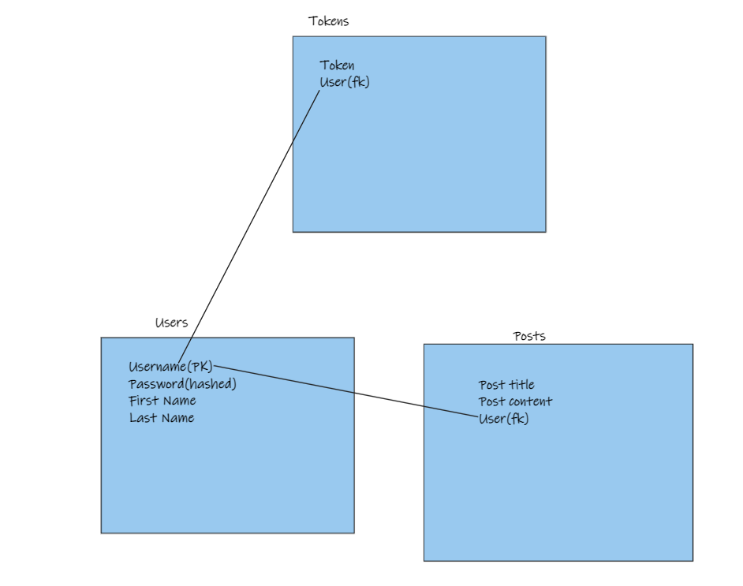

# Notes keeping app.
* Users can register/signin into their accounts.
* Users can add/delete notes to/from their page.
* Each users can see his notes only.

# Step 1: Designing the database
* check 

# Step 2: Connecting the database with python.
* In the future we wil use ORM, but for now we will use basic SQL commands.