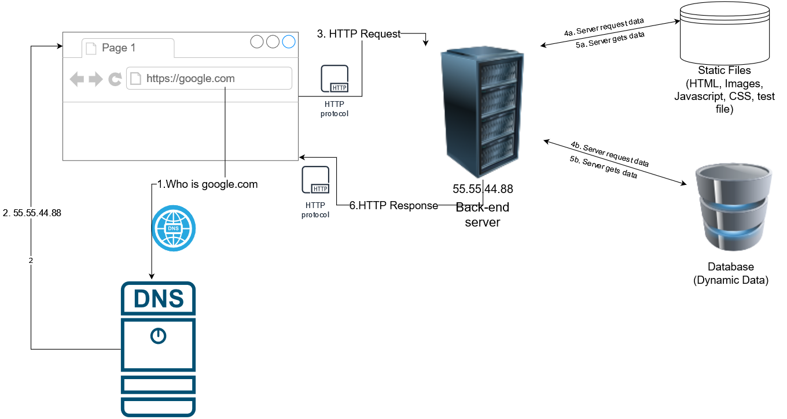
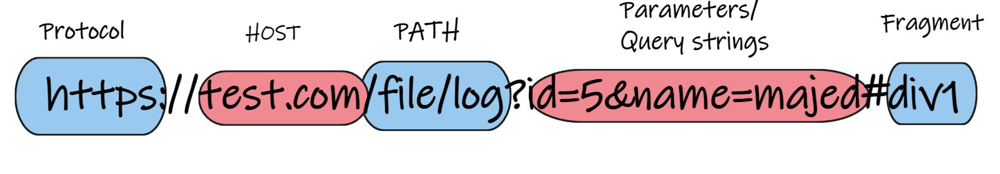
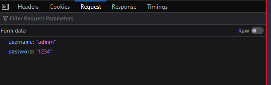

# How does the web work

* Protocol: It's a set of rules that multiple entities can use to exchange data.

* Back-end server can be developed using different programming languages: eg: PHP, C#/.net, Ruby, Python, Javascript(NodeJS) etc..

* Front-end / Client-side code: Can be a code that runs in your Web Browsers(written in HTML, Javascript and CSS) or Desktop/mobile applications can be written using other programming languages eg: Flutter, Unity, Java, Python, Swift etc...

* Static files: these files include media files(images, icons, videos, pdf files, exe files etc..), css, javascript and html codes etc.. (usually public files).

* Dynamic data: is data that is stored in a SQL or NoSQL databases we use some kind of queries to retrieve this kind of data from databases.

# HTTP(Hyper Text Transfer Protocol)
* HTTP is a protocol that specifies how can data be transferred between the server and the client(Web Browser / Mobile application)
* HTTP Request(The message sent by our web browser) main elements:
    1. URL
    2. Method (eg: GET, POST)
    3. Payload / data / request body.
    4. Headers.

### URL

### Methods
* Method specify how the is being sent to the server. For eg in HTML the default behavior for forms submitted using POST requests is to send data within the request body as seen in the image below but when using GET method the data is being within the URL's parameters segment as seen below.

* Most common HTTP Methods and when to use them (Note that html only recognizes GET and POST methods However other methods can be used using Javascript):
    1. GET: Retrieve data. eg: search.
    2. HEAD: Similar to GET, but it will only return the headers / not the content (More on that when explaining the HTTP Response).
    2. POST: Send data / Create objects. eg: Login(sending username/password), Signup(Creating a profile)
    3. PATCH: Update data eg: Update Profile(Change phone no)
    4. DELETE: Delete data eg: delete account/profile/image etc...
    5. OPTIONS: Get allowed HTTP Methods.
    6. PUT: For uploading files.

### HTTP Payloads
* This is the date sent to the server usually used with POST. PATCH, PUT.
* Don't confuse HTTP Data/ payloads with the parameters that are sent within the URL.
* This data can take different shapes:
    1. JSON Data (Very similar to python's dictionary) (application/json). eg: {"username": "admin", "password": "1234"}
    2. form-data (Usually used with HTML forms) (multipart/form-data or application/x-www-form-urlencoded) => eg: username=admin&password=1234
    3. XML (rarely used)
    4. Bytes/raw data(for files) eg: image/png, image/gig, audio/webm, application/pdf

### Headers
* Headers: consist of extra information sent to the back-end server that specify information about the client, the data sent, browser info, security related details, etc...
* Most common headers:
1. Content-Type: used to specify the content that you are sending in the HTTP payload. (Most common types are mentioned above.)
2. User-Agent: Used to specify the browser/Operating system used by the client. For example user-agent is used by google.com to return different html codes depending in your OS for example: Android vs Windows, another example is how websites for example Microsoft teams will give you an option to download different versions of the App based on your Operating system.

